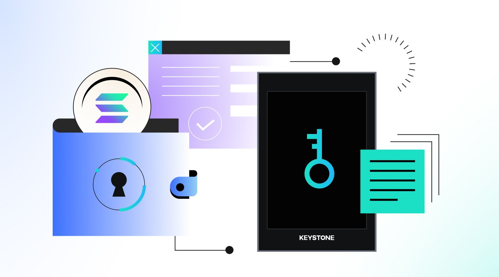
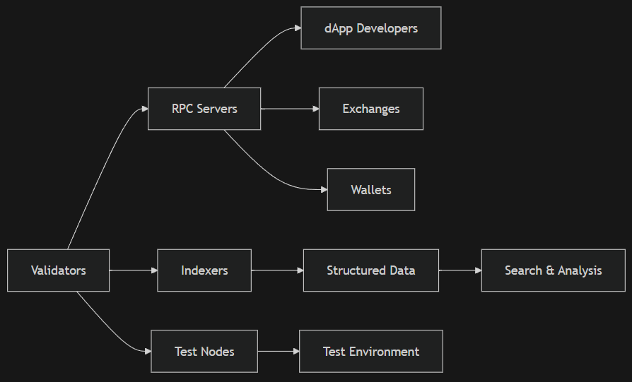
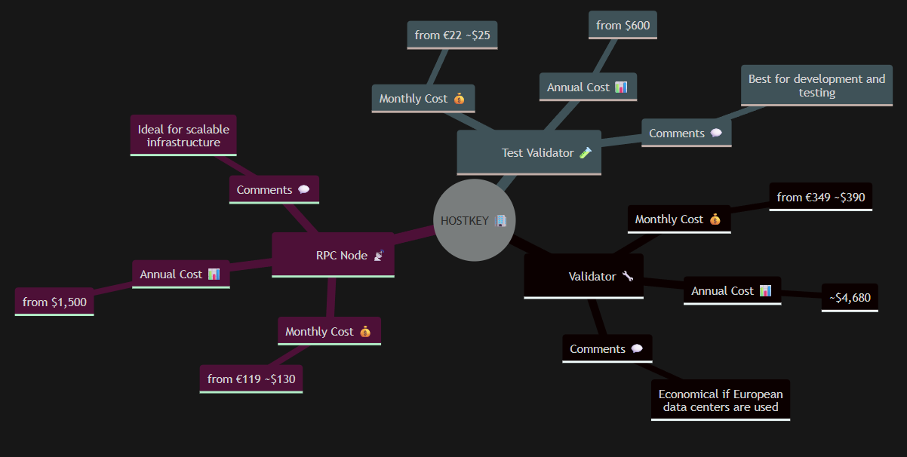

# Comparison of Server Parameters and Hosting Providers for Validating Blockchain Transactions Using Solana as an Example  
***Version 0.0.1***

## Optimization of CPU and Memory Parameters for Blockchain Validation Servers

Blockchain is a decentralized data storage system where each transaction is recorded in a chain of blocks, ensuring transparency and immutability of information. This allows the creation of trusted systems without central control, which has become the foundation for cryptocurrencies, decentralized applications (dApps), NFTs, and other innovations.

Validation servers for blockchain networks, particularly those supporting high-performance networks like Solana, require careful consideration of hardware specifications to ensure optimal performance. Among the most critical components are the central processor (CPU) and random-access memory (RAM), which directly impact transaction processing speed, registry synchronization efficiency, and overall system reliability.

### Choosing a Processor 
The choice for blockchain validation servers is largely determined by the need to support multithreading and high clock speeds. Multithreading allows the processor to execute multiple threads simultaneously, thereby enhancing its ability to handle parallel operations—this is crucial for blockchains processing thousands of transactions per second. For example, AMD EPYC processors have gained widespread recognition due to their multi-core architecture. Configurations with a minimum of 24 cores or high-frequency CPUs with 16+ cores are often considered ideal for validators in blockchain networks like Solana. The AMD EPYC 9254 processor features 24 cores at a clock speed of 2.9 GHz and effectively handles the computational tasks associated with blockchain validation. Such configurations not only improve transaction throughput but also reduce latency during consensus participation and data distribution.

### Random-Access Memory (RAM)
Plays an equally important role in ensuring smooth operation. Blockchain validators require significant memory—ranging from 256 to 512 GB, preferably DDR5 type—to meet their computational needs. This is due to the network architecture requiring fast access to large datasets for transaction verification and maintaining the state of the registry. Insufficient RAM can create bottlenecks during peak loads, leading to slower registry synchronization and degraded performance. For example, configurations offered by specialized blockchain solution providers like Cherry Servers include 384 GB DDR5 RAM, which represents a balance between cost and performance suitable for networks like Solana.

### Data Storage
Significantly impacts the efficiency of blockchain validation servers. NVMe SSDs are considered the preferred option over traditional SATA SSDs due to their higher read/write speeds exceeding 7000 MB/s compared to the SATA limit of 600 MB/s. This performance advantage reduces registry synchronization time—a critical factor for maintaining responsiveness in a rapidly changing environment. For hosting validator nodes, enterprise models of NVMe SSDs are recommended, with typical setups including separate drives for operating system installation and blockchain registry storage. For instance, Cherry Servers recommends using 2x1 TB NVMe drives for OS installation and 2x4 TB NVMe drives for registry storage, ensuring speed and durability.

#### Advantage of NVMe and SATA SSD for Blockchain Hosting

The rapid expansion of blockchain networks, especially high-performance systems like Solana, has necessitated a reevaluation of data storage solutions capable of managing significant volumes of information. As of April 2025, the Solana network generates approximately 80–95 TB of data annually under current traffic conditions, with potential growth to several petabytes if usage approaches full projected capacity. This underscores the critical importance of choosing data storage technologies that can efficiently handle such massive datasets while maintaining performance standards. In this context, NVMe SSDs (Non-Volatile Memory Express) have emerged as an excellent choice over traditional SATA SSDs due to their exceptional read/write speeds and lower latency, making them ideal for blockchain hosting environments.

NVMe SSDs operating on PCIe Gen4 x4 interfaces achieve sequential throughput of up to 7–8 GB/s, with enterprise models typically offering 5–7 GB/s read/write speeds. These figures sharply contrast with SATA III SSDs, which are limited to a maximum of 550 MB/s. For blockchain transaction validation workloads requiring high IOPS (up to 1 million random 4KB IOPS) and low latency (~100 µs), NVMe drives have a significant advantage over SATA and SAS options. Eliminating the SATA HBA layer allows NVMe drives to directly interact with the processor through PCIe, reducing latency and increasing efficiency. This capability is critical for blockchain nodes requiring fast registry synchronization, especially in high-performance applications like Solana.

### Network Bandwidth Requirements in High-Transaction Blockchain Networks

In blockchain networks with high transaction volumes, network bandwidth plays a crucial role in ensuring the smooth operation of nodes. The robustness of the underlying network infrastructure directly affects validators' and RPC nodes' ability to process transactions efficiently and disseminate blocks across the decentralized network. For example, Solana validators are recommended to use symmetrical fiber connections with speeds exceeding 1 Gbps, reflecting the platform's heightened data exchange appetite. Such stringent requirements stem from the need to maintain the high throughput embedded in blockchain architecture, which can generate approximately 80–95 TB of data annually under current traffic volumes, with potential growth to several petabytes per year if usage reaches projected capacity.

Monthly traffic limits for blockchain nodes further emphasize the importance of a reliable connection. Service providers focused on blockchain network loads like Solana often offer packages ranging from 100 TB to unlimited traffic, meeting the needs of networks where transaction volumes can exceed 100 TB per month. While Ethereum requires approximately 30–40 TB of monthly traffic with similar connection speeds of 1 Gbps. These figures highlight the importance of choosing hosting solutions capable of satisfying current and future demands.

Regional limitations leading to latency further complicate optimizing network bandwidth for blockchain nodes. Studies show that regions with higher network latency experience delays in block propagation, negatively impacting overall network throughput. For instance, even a few milliseconds of delay in block dissemination can cause significant performance bottlenecks, especially in high-performance networks like Solana. The strategic choice of hosting region becomes crucial to mitigate these effects. Service providers with a global data center network allow operators to host their nodes closer to users or other network participants, reducing latency and improving block synchronization. This geographic factor is particularly important when deploying nodes in regions with connectivity issues or where internet service providers set asymmetric upload/download ratios unsuitable for blockchain operations.

## Dedicated Servers for Blockchain Transaction Validation: A Comprehensive Analysis

Blockchain transaction validation is a computationally intensive process that requires robust and specialized infrastructure. Proposals for dedicated servers tailored to support blockchain workloads serve as critical solutions, especially for high-performance networks like Solana.

Pricing for dedicated servers supporting blockchain workloads varies significantly by region and RAID configuration. Medium-sized projects begin at approximately $1800 per month, while larger operations may exceed $3800 per month with additional resources. The cost reflects not only premium hardware but also the redundancy and scalability inherent in blockchain validation tasks. RAID configurations, such as enterprise NVMe disks set up in RAID 1 or RAID 10 arrays, enhance data resilience and fault tolerance—critical aspects due to the constant operation required by blockchain nodes.

## Innovations in Cloud Hosting for Blockchain Applications

The rapid advancement of blockchain technology has necessitated advanced hosting solutions capable of meeting its computational needs. Among the most transformative innovations is the integration of GPU acceleration into cloud hosting platforms, significantly enhancing performance for tasks such as transaction validation and smart contract execution. For example, Amazon Web Services (AWS) offers managed blockchain solutions that utilize GPU instances to optimize workloads requiring high parallel processing. These capabilities are particularly beneficial for blockchains like Solana, which use a Proof-of-History consensus mechanism to process thousands of transactions per second. Using AWS infrastructure, developers can deploy nodes with configurations tailored to the extensive computational requirements of modern decentralized applications.

Another important innovation in cloud hosting for blockchain applications is the implementation of automatic scaling. This feature allows dynamic allocation of resources based on current demand, ensuring stable performance even during transaction volume spikes. For example, providers integrate AI-based autoscaling solutions that smoothly adjust resource distribution, reducing operational costs while maintaining low response latency. Such systems are vital for supporting high-frequency trading (HFT) platforms and real-time DeFi protocols, where delays of even milliseconds can lead to significant financial losses. Autoscaling also addresses the issue of unpredictable network traffic characteristic of blockchain ecosystems, offering a reliable foundation for scalability without compromising reliability.

Integrations with blockchain-specific APIs further enhance the functionality of cloud hosting platforms. Tools provided by Solana, such as Gulf Stream protocol optimizations and custom plugins like Jupiter API and Jito client, simplify node deployment and management processes. These integrations allow developers to precisely configure node parameters, optimizing elements such as memory distribution and validator selection to meet their project's unique needs. Additionally, services like SOL Trading API bloXroute facilitate predictive caching and early transaction processing aligned with Solana's mempool-free design architecture. These achievements highlight the importance of platform compatibility when selecting a hosting provider, as they directly impact blockchain operations' efficiency and adaptability.

Despite these advancements, there are notable trade-offs between traditional virtual private servers (VPS) or dedicated servers and modern cloud solutions optimized for specific blockchain use cases. Traditional setups, such as bare-metal servers, excel in performance and configuration control, making them ideal for critical applications. However, they often come at a higher cost and lack the scalability of cloud alternatives. Conversely, cloud solutions offer greater flexibility and economic efficiency but may struggle to match the raw performance of dedicated hardware under extreme loads. This dilemma underscores the need for careful evaluation of an organization's priorities—whether it be performance, customization, or budget constraints—when choosing a hosting strategy.

## Brief Overview of Blockchain Technologies and Analysis of Hosting Providers with Solana Example

**Solana** is one of the most high-performance blockchain networks, capable of processing up to **65,000 transactions per second** thanks to its unique architecture that combines Proof-of-History (PoH) with traditional Proof-of-Stake (PoS). This makes it one of the most popular platforms for DeFi, Web3, and fast smart contracts.

### Key Components of Solana:

1. **Validators** — Participate in consensus, verify transactions, vote on blocks, receive rewards.
2. **RPC Servers (Remote Procedure Call nodes)** — Provide API for interacting with the network, used by dApp developers, exchanges, and wallets.
3. **Indexers** — Collect data about transactions, accounts, events, and store them in a structured format for easy search and analysis.
4. **Test Nodes (Test Validators / DevNet)** — Local or remote nodes used by developers to test smart contracts, dApps, and new features before launching on the mainnet.

### Resources Required for Solana Components

Each type of node has its own hardware resource requirements. Below are the recommended specifications:

| Type of Node | Processor (CPU)         | RAM     | Disk        | Network   | Note                                               |
|--------------|-------------------------|---------|-------------|-----------|----------------------------------------------------|
| **Validator**    | 24+ cores (AMD EPYC/Intel Xeon) | 512 GB DDR4+ | 2x2TB NVMe RAID0+ | 1–10 Gbps | Requires a lot of memory and disk speed            |
| **RPC Node**     | 8–16 cores              | 64–128 GB | 1–2 TB NVMe    | 1 Gbps    | Stability and availability are crucial             |
| **Indexer**      | 8–16 cores              | 64–256 GB | 2–4 TB NVMe    | 1 Gbps    | Requires a powerful database                       |
| **Test Node**    | 4–8 cores               | 16–32 GB  | 100 GB+ NVMe   | 100 Mbps  | Suitable even for mid-level VPS                    |

GPUs are **not currently mandatory** for most Solana components, as computations occur on the CPU. However, GPUs can be used for specific tasks such as data analysis, machine learning, and indexing large volumes.

**Dedicated servers are preferable**, especially for validators, because they provide:
- Full control over hardware
- High performance and stability
- Scalability options
- Lack of "noisy neighbors" (unlike VPS)

**VPS is suitable only for:**
- RPC nodes
- Indexers
- Test nodes

Cloud solutions (AWS, Google Cloud, Azure) are possible but require proper configuration under Solana load to avoid delays and overloads.

### U.S., European, and UK Market of Hosters: Ready-made Solutions and Universal Providers

The market offers both specialized hosters providing ready-made blockchain solutions and universal providers that can be adapted for Solana needs.

* **Universal Hosters:**
  - **Hostkey** — Powerful servers with AMD EPYC/Ryzen processors featuring many cores, high-throughput network, and locations in various countries. Offers the lowest prices on the market. Cryptocurrency payment possible.
  - **Cherry Servers** — Bare-metal servers, AMD EPYC, NVMe SSDs, global data center network.
  - **Bacloud** — Powerful servers for Solana validators, cryptocurrency payments, flexible configuration.
  - **AWS / Google Cloud / Azure** — Cloud solutions offering flexibility but more complex to optimize for Solana.

* **Specialized Hosters:**
  - **Chainstack** — Managed nodes, elastic RPC, free plans, cryptocurrency payment options.
  - **Blockdaemon** — Enterprise level, supports multiple networks, SLA and monitoring.
  - **Dysnix** — Specializes in blockchain, offers GPU/VPS/dedicated servers, supports Solana, Ethereum, Cosmos, and other networks.

### Comparative Table of Providers

| Hoster       | Validator | RPC | Testnet | Price      | Note                                               |
|--------------|-----------|-----|---------|------------|----------------------------------------------------|
| **HOSTKEY**  | ✅        | ✅  | ✅      | from €349/month (validator) | Flexible configurations, ready-made and custom-built servers |
| **Cherry Servers** | ✅   | ✅  | ✅      | from $798/month | Bare-metal, EPYC                                       |
| **Bacloud**  | ✅        | ✅  | ✅      | from $1800/month | Custom order                                         |
| **Chainstack** | ❌     | ✅  | ❌      | from $0   | Managed nodes                                        |
| **Dysnix**   | ✅        | ✅  | ✅      | $500+/month | Specialization in blockchain                          |
| **AWS**      | ⚠️ (more complex to configure) | ✅ | ✅ | $ | Scalability                                          |

### Choosing Machines for Solana Using the HOSTKEY Provider Example

HOSTKEY offers several types of servers suitable for various tasks within the Solana network. Let's explore which options are best suited for different blockchain components:

* **VPS (Virtual Private Server)**
  - Suitable for: **Test Validator, DevNet, RPC Node, Indexers, DeFi**
  - Recommended plans: **v2, v3, ryzen or higher**:
    - **vm.v2-heavy**, 8 cores, 16 GB RAM, 240 GB NVMe (from €22/month)
    - **vm.ryzen-16**, 8 cores, 16 GB RAM, 120 GB NVMe (from €40/month)
    - **vm.v3-ultra**, 10 cores, 64 GB RAM, 1 TB NVMe (from €85/month)

  🔗 [VPS Plans](https://HOSTKEY.com/vps/)

* **VDS (Instant Dedicated)**
  - Suitable for: **RPC Node, Indexers, DeFi**
  - Recommended plan: **vds.ryzen-64**

  🔗 [VDS Instant](https://HOSTKEY.com/dedicated-servers/instant/)

* **Custom Configured Dedicated Server (4th Gen AMD/Intel)**
  - Suitable for: **Test Validator, DevNet, RPC Node, Indexers, DeFi, Solana Validator**
  - Configurations:
    - EPYC 9354 with 32 cores, 384 GB RAM, 2x2 TB NVMe, network 1G (from €349/month)
    - EPYC 9354 with 32 cores, 768 GB RAM, 2x3.84 TB NVMe, network 10G (from €599/month)
  - Advantages: Fully meets Solana's requirements
  - Disadvantages: Requires manual configuration

  🔗 [Server Configurator](https://HOSTKEY.com/dedicated-servers/4th-gen-amd-intel/)

### Total Cost of Ownership Comparison

| Hoster        | Server Type                      | Monthly Cost     | Annual Cost      | Comments                              |
|---------------|----------------------------------|------------------|------------------|---------------------------------------|
| **HOSTKEY**   | Validator (custom-configured)    | from €349 (~$390)| ~$4,680          | Economical if European data centers are needed  |
| **Cherry Servers** | Validator (EPYC)            | from $798        | from $9,576      | SLA 99.97%, good quality              |
| **Bacloud**   | Validator (custom order)         | from $1,800      | from $21,600     | High performance level                |
| **Dysnix**    | Validator (bare metal)           | from $500        | from $6,000      | Budget option, requires coordination  |
| **AWS**       | Validator (EC2 m6a.16xlarge + EBS)| from $1,200     | ~$14,400         | Challenges with disks and network     |
| **HOSTKEY**   | RPC Node (ryzen-64)                 | from €119 (~$130)| from $1,560      | Ideal for small business              |
| **Cherry Servers** | RPC Node (i7 BM)             | from $199        | from $2,388      | More scalability options              |
| **HOSTKEY**   | Test Validator (v2, v3, ryzen)           | from €22 (~$25)  | from $660        | Most economical for development       |

## Conclusion

For specific types of Solana nodes, certain server types are necessary:
- **VPS** — for testing and development
- **VDS** — for RPC and DeFi services
- **GPU** — for parallel computations and analytics
- **Custom Configured Dedicated Servers** — for a full-fledged Solana Validator

For blockchain projects with medium to high load, **VDS or configurable servers** are sufficient.